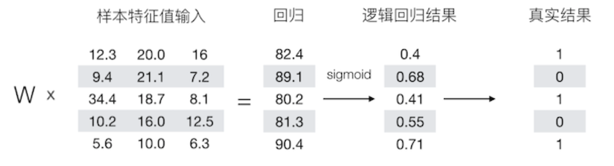
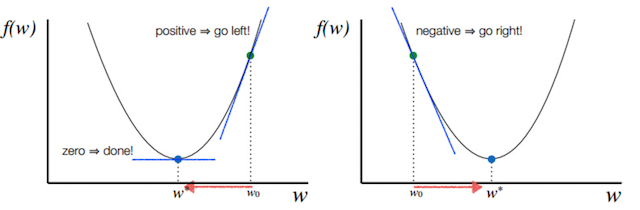
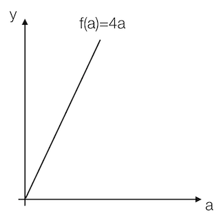
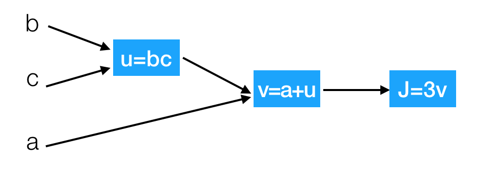

# 1.2 神经网络基础

## 学习目标

- 目标
  - 知道逻辑回归的算法计算输出、损失函数
  - 知道导数的计算图
  - 知道逻辑回归的梯度下降算法
  - 知道多样本的向量计算
- 应用
  - 应用完成向量化运算
  - 应用完成一个单神经元神经网络的结构

### 1.2.1 Logistic回归

#### 1.2.1.1 Logistic回归

逻辑回归是一个主要用于二分分类类的算法。那么逻辑回归是给定一个x*x* , 输出一个该样本属于1对应类别的预测概率$\hat{y}=P(y=1|x)$。

Logistic 回归中使用的参数如下：

- **输入的特征向量**：$x \in R^{n_x}$,$x$是一个 $nx$维的特征数量，用于训练的标签：$y \in 0,1$
- **参数**：权重：$w \in R^{n_x}$, 偏置：$b \in R$
- 输出预测结果：$\hat{y} = \sigma(w^Tx+b)=\sigma(w_1x_1+w_2x_2+...+b)=\sigma(\theta^Tx)$
  - Sigmoid 函数： $s = \sigma(w^Tx+b) = \sigma(z) = \frac{1}{1+e^{-z}}$
  - 如果*z*的结果非常大，那么S的结果接近于1
  - 如果*z*的结果较小或者是非常大的负数，那么S的结果接近于0


$e^{-z}$的函数如下


例如：



#### 1.2.1.2 逻辑回归损失函数

**损失函数（loss function）**用于衡量预测结果与真实值之间的误差。最简单的损失函数定义方式为平方差损失：

$$L(\hat{y},y) = \frac{1}{2}(\hat{y}-y)^2$$

逻辑回归一般使用$L(\hat{y},y) = -(y\log\hat{y})-(1-y)\log(1-\hat{y})$

该式子的理解：

- 如果y=1,损失为$- \log\hat{y}$，那么要想损失越小，$\hat{y}$的值必须越大，即越趋近于或者等于1
- 如果y=0,损失为$1\log(1-\hat{y})$,那么要想损失越小，那么$\hat{y}$的值越小，即趋近于或者等于0

损失函数是在单个训练样本中定义的，它衡量了在**单个**训练样本上的表现。**代价函数（cost function）**衡量的是在**全体**训练样本上的表现，即衡量参数 w 和 b 的效果，所有训练样本的损失平均值

$$J(w,b) = \frac{1}{m}\sum_{i=1}^mL(\hat{y}^{(i)},y^{(i)})$$

### 1.2.2 梯度下降算法

目的：使损失函数的值找到最小值

方式：梯度下降

函数的**梯度（gradient）**指出了函数的最陡增长方向。**梯度的方向走，函数增长得就越快。那么按梯度的负方向走，函数值自然就降低得最快了**。模型的训练目标即是寻找合适的 w 与 b 以最小化代价函数值。假设 **w 与 b 都是一维实数**，那么可以得到如下的 J 关于 w 与 b 的图：


可以看到，成本函数 J 是一个**凸函数**，与非凸函数的区别在于其不含有多个局部最低。

参数w和b的更新公式为：

$$w := w - \alpha\frac{dJ(w, b)}{dw}，b := b - \alpha\frac{dJ(w, b)}{db}$$

> 注：其中 α 表示学习速率，即每次更新的 w 的步伐长度。当 w 大于最优解 w′ 时，导数大于 0，那么 w 就会向更小的方向更新。反之当 w 小于最优解 w′ 时，导数小于 0，那么 w 就会向更大的方向更新。迭代直到收敛。

通过平面来理解梯度下降过程：



### 1.2.3 导数

理解梯度下降的过程之后，我们通过例子来说明梯度下降在计算导数意义或者说这个导数的意义。

#### 1.2.3.1 导数

导数也可以理解成某一点处的斜率。斜率这个词更直观一些。

- 各点处的导数值一样



我们看到这里有一条直线，这条直线的斜率为4。我们来计算一个例子

例：取一点为a=2,那么y的值为8，我们稍微增加a的值为a=2.001,那么y的值为8.004，也就是当a增加了0.001，随后y增加了0.004，即4倍

那么我们的这个斜率可以理解为当一个点偏移一个不可估量的小的值，所增加的为4倍。

可以记做$\frac{f(a)}{da}$或者$\frac{d}{da}f(a)$

- 各点的导数值不全一致


例：取一点为a=2,那么y的值为4，我们稍微增加a的值为a=2.001,那么y的值约等于4.004（4.004001），也就是当a增加了0.001，随后y增加了4倍

取一点为a=5,那么y的值为25，我们稍微增加a的值为a=5.001,那么y的值约等于25.01（25.010001），也就是当a增加了0.001，随后y增加了10倍

可以得出该函数的导数2为2a。

- 更多函数的导数结果

|                         函数                         |            导数            |
| :--------------------------------------------------: | :------------------------: |
|                     $f(a) = a^2$                     |            $2a$            |
|                      $f(a)=a^3$                      |           $3a^2$           |
|                     $f(a)=ln(a)$                     |       $\frac{1}{a}$        |
|                     $f(a) = e^a$                     |           $e^a$            |
|           $\sigma(z) = \frac{1}{1+e^{-z}}$           |  $\sigma(z)(1-\sigma(z))$  |
| $g(z) = tanh(z) = \frac{e^z - e^{-z}}{e^z + e^{-z}}$ | $1-(tanh(z))^2=1-(g(z))^2$ |

#### 1.2.3.2 导数计算图

那么接下来我们来看看含有多个变量的导数流程图，假设$J(a,b,c) = 3{(a + bc)}$

我们以下面的流程图代替



这样就相当于从左到右计算出结果，然后从后往前计算出导数

- 导数计算

问题：那么现在我们要计算J相对于三个变量a,b,c的导数？

假设b=4,c=2,a=7,u=8,v=15,j=45

- $\frac{dJ}{dv}=3$

增加v从15到15.001，那么$J\approx45.003$

- $\frac{dJ}{da}=3$

增加a从7到7.001,那么$v=\approx15.001$，$J\approx45.003$

这里也涉及到链式法则

#### 1.2.3.3 链式法则

- $\frac{dJ}{da}=\frac{dJ}{dv}\frac{dv}{da}=3*1=3$

J相对于a增加的量可以理解为J相对于v,  v相对于a增加的

接下来计算

- $\frac{dJ}{db}=6=\frac{dJ}{du}\frac{du}{db}=3*2=6$
- $\frac{dJ}{dc}=12=\frac{dJ}{du}\frac{du}{dc}=3*4=12$

#### 1.2.3.4 逻辑回归的梯度下降

逻辑回归的梯度下降过程计算图，首先从前往后的计算图得出如下

- $z = w^Tx + b$
- $\hat{y} =a= \sigma(z)$
- $L(\hat{y},y) = -(y\log{a})-(1-y)\log(1-a)$

那么计算图从前向过程为,假设样本有两个特征


问题：计算出$J $关于$z$的导数

- $dz = \frac{dJ}{da}\frac{da}{dz} = a-y$
  - $\frac{dJ}{da} = -\frac{y}{a} + \frac{1-y}{1-a}$
  - $\frac{da}{dz} = a(1-a)$

所以我们这样可以求出总损失相对于$w_1$,$w_2$,$b$参数的某一点导数，从而可以更新参数

- $\frac{dJ}{dw_1} = \frac{dJ}{dz}\frac{dz}{dw_1}=dz*x1$
- $\frac{dJ}{dw_2} = \frac{dJ}{dz}\frac{dz}{dw_1}=dz*x2$
- $\frac{dJ}{db}=dz$

相信上面的导数计算应该都能理解了，所以当我们**计算损失函数的某个点相对于$w_1$,$w_2$,$b$的导数之后，就可以更新这次优化后的结果。**

$w_1 := w_1 - \alpha\frac{dJ(w_1, b)}{dw_1}$

$w_2 := w_2 - \alpha\frac{dJ(w_2, b)}{dw_2}$

$b := b - \alpha\frac{dJ(w, b)}{db}$

### 1.2.4 向量化编程

**每更新一次梯度时候，在训练期间我们会拥有m个样本，那么 这样每个样本提供进去都可以做一个梯度下降计算。所以我们要去做在所有样本上的计算结果、梯度等操作**

$$J(w,b) = \frac{1}{m}\sum_{i=1}^mL({a}^{(i)},y^{(i)})$$

计算参数的梯度为：$d(w_1)^{i}, d(w_2)^{i},d(b)^{i}$,这样，我们想要得到最终的$d{w_1},d{w_2},d{b}$，如何去设计一个算法计算？伪代码实现：	 

> 初始化，假设
>
> ${J} = 0, dw_1=0, dw_2=0, db={0}$
>
> for i in m:
>
>  $z^i = w^Tx^i+{b}$
>
>  $a^i = \sigma(z^i)$
>
>  $J +=-[y^ilog(a^i)+(1-y^i)log(1-a^i)]$
>
>  每个梯度计算结果相加
>
> $ dz^i = a^i-y^{i}$
>
>  $dw_1 += x_1^idz^i$
>
>  $dw_2 +=x_2^idz^i$
>
>  $db+=dz^i$
>
> 最后求出平均梯度
>
> $J /=m$
>
> $dw_1 /= m$
>
> $dw_2 /= m$
>
> $db /= m$

#### 1.2.4.1 向量化优势

**什么是向量化**

由于在进行计算的时候，最好不要使用for循环去进行计算，因为有Numpy可以进行更加快速的向量化计算。

在公式$z = w^Tx+b$中$w$,$x$都可能是多个值，也就是$\bar w = \left( \begin{array}{c}w_{1} \\ \vdots \\w_{n}\end{array}\right), \bar x= \left(\begin{array}{c}x_{1} \\\vdots \\x_{n} \end{array}\right)$

```python
import numpy as np
import time
a = np.random.rand(100000)
b = np.random.rand(100000)
```

- 第一种方法

```python
# 第一种for 循环
c = 0
start = time.time()
for i in range(100000):
    c += a[i]*b[i]
end = time.time()

print("计算所用时间%s " % str(1000*(end-start)) + "ms")
```

- 第二种向量化方式使用np.dot

```python
# 向量化运算
start = time.time()
c = np.dot(a, b)
end = time.time()
print("计算所用时间%s " % str(1000*(end-start)) + "ms")
```

Numpy能够充分的利用并行化，Numpy当中提供了很多函数使用

|        函数         |       作用       |
| :-----------------: | :--------------: |
| np.ones or np.zeros | 全为1或者0的矩阵 |
|       np.exp        |     指数计算     |
|       np.log        |     对数计算     |
|       np.abs        |    绝对值计算    |

**所以上述的m个样本的梯度更新过程，就是去除掉for循环。原本这样的计算**

#### 1.2.4.2 向量化实现伪代码

- 思路

|  $z^1 = w^Tx^1+b$   |  $z^2 = w^Tx^2+b$   |  $z^3 = w^Tx^3+b$   |
| :-----------------: | :-----------------: | :-----------------: |
| $a^1 = \sigma(z^1)$ | $a^2 = \sigma(z^2)$ | $a^3 = \sigma(z^3)$ |

可以变成这样的计算

$\bar w = \left(\begin{array}{c}w_{1} \\ \vdots \\w_{n}\end{array}\right)， \bar{x} = \left(\begin{array}{cccc}\vdots & \vdots & \vdots & \vdots &\vdots \\ x^1& x^2 & x^3 & \vdots & x^m \\ \vdots &\vdots & \vdots & \vdots & \vdots \end{array}\right)$

注：w的形状为(n,1), x的形状为(n, m)，其中n为特征数量，m为样本数量

我们可以让$Z= {W^T}X + b=\left(z^1, z^2,z^3\cdots z^m \right)+b=np.dot(W^T,X)+b$，得出的结果为(1, m)大小的矩阵 注：大写的$W,X$为多个样本表示

- 实现多个样本向量化计算的伪代码

> 初始化，假设n个特征,m个样本
>
> $J = 0, W=np.zeros([n,1]), b={0}$
>
> $Z= np.dot(W^T,X)+{b}$
>
> $A = \sigma(Z)$ 
>
> 每个样本梯度计算过程为：
>
> $dZ = {A}-{Y}$
>
> $dW = \frac{1}{m}X{dZ}^{T}$
>
> $db=\frac{1}{m}np.sum(dZ)$
>
> 更新
>
> $W := W - \alpha{dW}$
>
> $b := b - \alpha{db}$

这相当于一次使用了M个样本的所有特征值与目标值，那我们知道如果想多次迭代，使得这M个样本重复若干次计算

### 1.2.5 正向传播与反向传播

前面我们所做的整个过程分为两个部分，一个是从前往后的计算出梯度与损失，另外一部分是从后往前计算参数的更新梯度值。所以在神经网络当中会经常出现两个概念，正向传播与反向传播。

